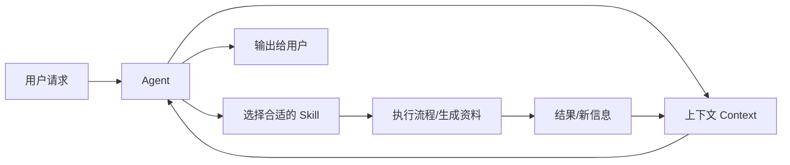

# 概念关系说明：Agent、大模型的上下文、Skill

## 1. 总体关系

可以把三者想象成一个“会学习的人”：

- **Agent** 是这个人本身——有目标、能思考、会行动。
- **上下文** 是他此刻能记住的所有信息——正在看的资料、刚说的话、收到的反馈。
- **Skill** 是他掌握的一套“做事方法”——遇到某类任务时，按固定流程执行。

Agent 借助上下文理解当前处境，再调用合适的 Skill 去完成任务；Skill 执行过程中产生的新信息，又会回到上下文，供 Agent 下一步决策。

## 2. 三者对比表

| 概念 | 核心角色 | 关键作用 | 类比 |
|------|----------|----------|------|
| Agent | 执行者 / 决策者 | 感知环境、规划步骤、调用工具、完成目标 | 一位能自主办事的助手 |
| 上下文 | 短期记忆 / 输入信息 | 让 Agent 知道“现在发生了什么”，决定每次推理能看到多少信息 | 助手桌上的文件和便签 |
| Skill | 可复用能力 / 任务模板 | 把某类任务的流程、输入输出、自检标准固化下来，供 Agent 反复调用 | 助手的标准作业程序（SOP） |

## 3. 上下文如何影响 Agent 的工作

上下文直接决定 Agent 能否正确理解任务、做出合理决策：

- **上下文足够时**：Agent 能基于完整背景进行多步推理，例如记住用户之前说的“预算 5000 元”，不会在后续推荐中超出预算。
- **上下文不足时**：Agent 会“失忆”或产生幻觉，例如忘记任务目标、重复提问、给出与背景矛盾的答案。
- **上下文过长时**：可能触发上下文窗口上限，导致重要信息被截断；也可能让模型“顾此失彼”，忽略中间内容。

因此，设计 Agent 时必须主动管理上下文：保留关键指令、精简无关信息、必要时使用外部记忆（向量数据库）来补充。

## 4. Skill 如何沉淀可复用的任务知识

Skill 的作用是把“怎么做某类事”从 Agent 的临时推理中抽离出来，形成稳定复用的知识：

- **从一次性到可复用**：没有 Skill 时，每次都要写一大段提示词；有了 Skill，只需改输入参数。
- **规范输出质量**：Skill 定义了输出结构和自检清单，减少每次结果的随机性。
- **便于迭代优化**：发现流程有问题时，只需修改 Skill 文件，所有调用它的任务都会同步改进。
- **支持协作共享**：Skill 以文件形式存在仓库中，可以被他人复用，也可以版本化管理。

## 5. 协同工作流程（Mermaid）

流程说明：

1. 用户向 Agent 提出请求；
2. Agent 把请求和历史信息放入上下文；
3. Agent 判断该调用哪个 Skill；
4. Skill 按既定流程执行任务；
5. 执行结果返回上下文，Agent 决定下一步；
6. 最终把结果输出给用户。

## 6. 个人判断

我认为，这三个概念的关系可以总结为：**上下文是 Agent 的“信息输入”，Skill 是 Agent 的“方法库”**。没有上下文，Agent 无法正确理解任务；没有 Skill，Agent 每次都要重新发明流程，难以保证质量。本次作业创建“概念学习资料生成 Skill”的过程，正是把“生成学习资料”这一重复任务沉淀为可复用方法，让 Agent 未来遇到任何新概念都能按同一标准产出资料。
